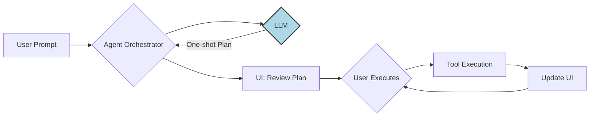
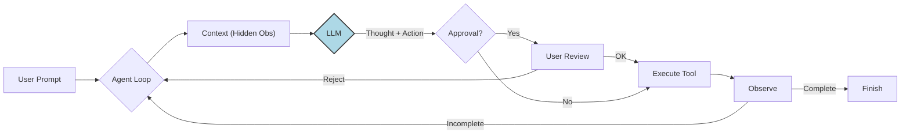

# ForgeAI: A Unity Editor AI Assistant

ForgeAI is an autonomous, intelligent AI agent integrated into the Unity Editor. It empowers developers by automating complex tasks—such as manipulating scenes, managing assets, and creating custom editor tools—directly within the project context.

Unlike existing solutions like Unity Muse, ForgeAI is designed to deeply understand the project's context, including reading operations, allowing it to take more informed and relevant actions. The initial motivation for this tool emerged from the challenges faced by a game development team struggling with complex Git operations, fixing wrongly named assets, and organizing project files.

This project also serves as the final project for a "Prompt Engineering" lecture, exploring advanced techniques for AI agent design and interaction within a practical application. The core architectural pattern for the AI's implementation is currently under experimentation.

## Overview

ForgeAI is an intelligent AI agent for the Unity Editor that autonomously solves problems and automates tasks.

### Example Problems ForgeAI Intends to Solve

ForgeAI can tackle a wide range of complex, multi-step tasks that require project context, reasoning, and the use of multiple tools. Below are examples of user prompts that demonstrate its capabilities:

-   > *"Analyze the naming convention used in the project, then find all files that break this convention and rename them correctly."*
-   > *"Find all commits by the user 'Yalkin' from the last month and create a short summary of their activity."*
-   > *"Change the colors of all Light components randomly in the currently open scene to test different lighting moods."*
-   > *"Create a new projectile particle effect that looks like a magic spell cast from a player's hand. After creating it, commit the new asset with an appropriate message and push the changes."*
-   > *"Analyze the C# code in the selected files. Critique it for any issues related to performance, style, or adherence to best practices, and then suggest refactorings."*

---

## Core Concepts

ForgeAI's design revolves around several key principles and architectural patterns, enabling its intelligent behavior within the Unity Editor.

-   **Conversational UI**: Interact with the agent through a simple chat-based window right inside the Unity Editor.
-   **Extensible Tooling**: The agent's capabilities are defined by a set of tools. Adding new tools is as simple as creating a C# class, making the agent easy to extend.
-   **Safety First**: By default, any action that modifies your project (like writing or deleting files) requires your explicit approval, giving you full control.

### 1. Orchestration Approach (Initial Design)

My first attempt at building ForgeAI, focusing on structure and predictability.

#### Motivation
*   Our team struggled with messy projects: bad asset names and broken git branches.
*   ForgeAI was born from a need for a smart assistant to fix these issues.

#### Core Design
*   **Fundamental Tools:** Started with three core tools: `RenameAI`, `MoveAI`, and `GitOperationAI`.
*   **Structured Tool Calls:** Forced the LLM to output a strict JSON format for tool commands.
    *   `[image: Example of the JSON format for a RenameAI tool call]`
*   **Command Pattern for Safety:** Displayed a full plan to the user before execution and added an "Undo" button for each step. This gave the user full control.
    *   `[gif: UI showing a proposed plan with 'Execute' and 'Undo' buttons]`
*   **Central Orchestrator:** An AI orchestrator broke down user requests into a step-by-step plan using the available tools.
    *   `[image: Diagram showing User Prompt -> Orchestrator -> JSON Plan]`

#### Weaknesses
*   **One-Shot Plans:** The orchestrator created a complete plan upfront and couldn't change it based on tool results.
    *   `[gif: A failed plan where a tool's output is ignored, leading to an error]`
*   **No User Interaction:** The plan ran from start to finish with no way for the user to step in.
*   **No Memory:** The agent had no memory of past actions or context.

### 2. ReAct Approach (Evolving Design)

This approach was developed to address the limitations of the initial Orchestration model, embracing a more dynamic and interactive agent paradigm.

-   **ReAct Engine**: The agent operates in a continuous loop: **Reason** (Thought) -> **Act** (Action) -> **Observe** (Result).

#### Key Differences from Classic ReAct
-   **Active Memory Compression**: To save context window space, past raw tool outputs are hidden. The agent *must* summarize key findings in its "Thought" block immediately, or they are lost.
-   **Explicit Approval Step**: Dangerous actions (like writing files) trigger a "Waiting for Approval" state, pausing the loop until the user consents.
-   **Multi-Action Support**: The agent can propose multiple independent actions in a single turn to be executed in batch.

---

## Branch Structure

This repository contains two primary proof-of-concept branches, each exploring a different architectural pattern for the AI agent.

-   **`poc/react` (ReAct Pattern):** This branch demonstrates a ReAct (Reason+Act) pattern. The system operates in a stateless loop, prompting an LLM with a set of available tools and relying on its reasoning to decide the next immediate action. The C# engine's primary role is to parse the LLM's response, execute the single requested tool, and return the result. It's highly flexible and depends on the LLM's ability to chain thoughts and actions turn by turn.

-   **`poc/orchestration` (Planner Pattern):** This branch uses a Planner or Orchestrator pattern. It begins with a dedicated planning phase where an LLM generates a complete, multi-step execution plan in a structured format (JSON). A stateful C# engine then executes this plan sequentially, managing the state and passing data between each step. This approach is more structured and predictable, giving the user a full view of the intended actions before they begin.

Beyond the Proof-of-Concept branches, this repository utilizes standard Git branching conventions for ongoing development:

-   **`develop`**: This branch serves as the integration point for all new features and ongoing development. All feature work is eventually merged here before being considered for a release.
-   **`feature/*`**: These branches are created for specific new features, bug fixes, or experimental work. They are branched off `develop` and merged back once completed, ensuring isolated development.

---

## Further Documentation

-   **[Changelog](./CHANGELOG.md)**: A log of all major updates, features, and bug fixes.
-   **[Design Journal](./doc/DESIGN_JOURNAL.md)**: Detailed notes on design decisions, challenges faced, and architectural evolution.